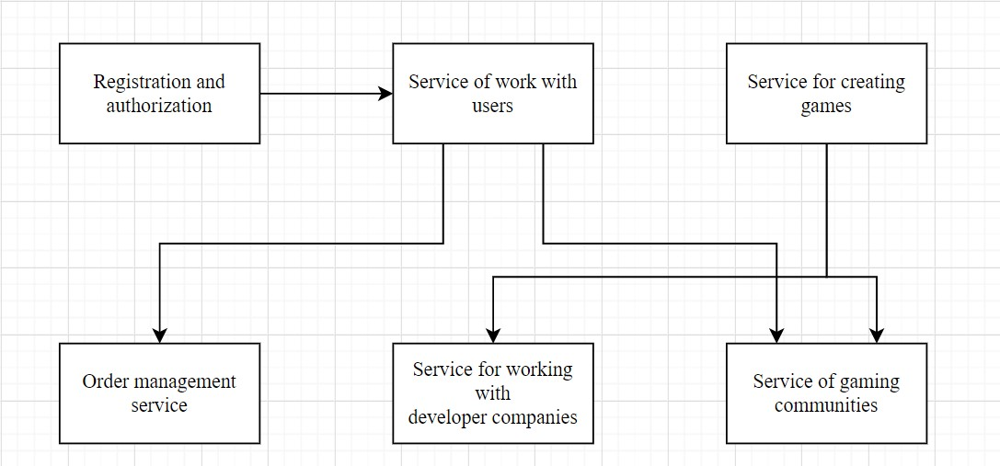

# Online game store
### Group members(IS-1814R):
 Karina Utebayeva  
 Alisher Kuttybai  

### Emails: 
 karinautebayeva@gmail.com  
 alisherkuttybai@gmail.com  

## Description of the project:
An online game store, a regular game service for buying and downloading games, and more. That is, it is similar to Steam Store and Epic Store.
 
## Microservices:
### Karina:
  1) Service of gaming communities
  2) Service for creating games
  3) Order management service
### Alisher:
  4) Service logging
  5) Service of work with users
  6) Registration and authorization service
 
## Microservices's diagram:

## Eureka:

